# 🧩 Sudoku Sally — Monorepo

Beautiful, modern **Sudoku** game (mobile) + realtime backend + marketing/download site — all in one repo, with full CI/CD to the cloud.

**Live site:** https://sudoku.gowithsally.com · **API:** https://api.sudoku.gowithsally.com · **Download APK:** [latest release](https://github.com/salistar/sudo-sally/releases/latest)

---

## 📦 Repository layout

| Folder | What | Stack |
|--------|------|-------|
| [`mobile/`](./mobile) | The Sudoku Sally app | Expo SDK 52 · React Native 0.76 · expo-router · TypeScript |
| [`backend/`](./backend) | REST API + realtime challenge server | Node.js · Express · Socket.IO · MongoDB · JWT |
| [`landing/`](./landing) | Multi-page marketing & download site | Static HTML/CSS/JS · nginx |
| [`deploy/`](./deploy) | Production Docker stack + Caddy reverse-proxy snippet | docker compose |
| [`.github/workflows/`](./.github/workflows) | CI/CD pipelines | GitHub Actions |
| [`docs/screenshots/`](./docs/screenshots) | Mobile app screenshots | — |

> The native folders `mobile/android` and `mobile/ios` are **not committed** — they are regenerated reproducibly by `expo prebuild` in CI.

---

## 📱 Mobile screenshots

| Splash | Welcome / Language | Home | Levels |
|:---:|:---:|:---:|:---:|
| 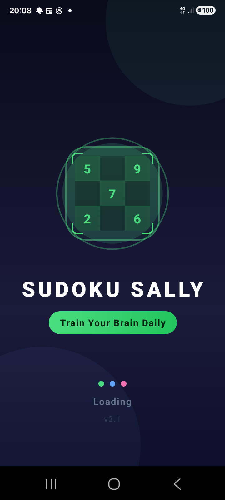 | 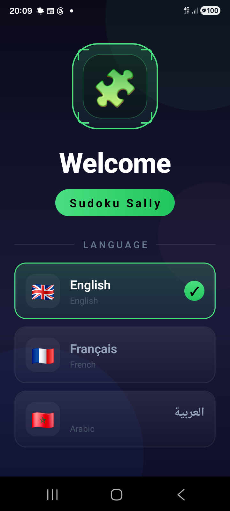 | 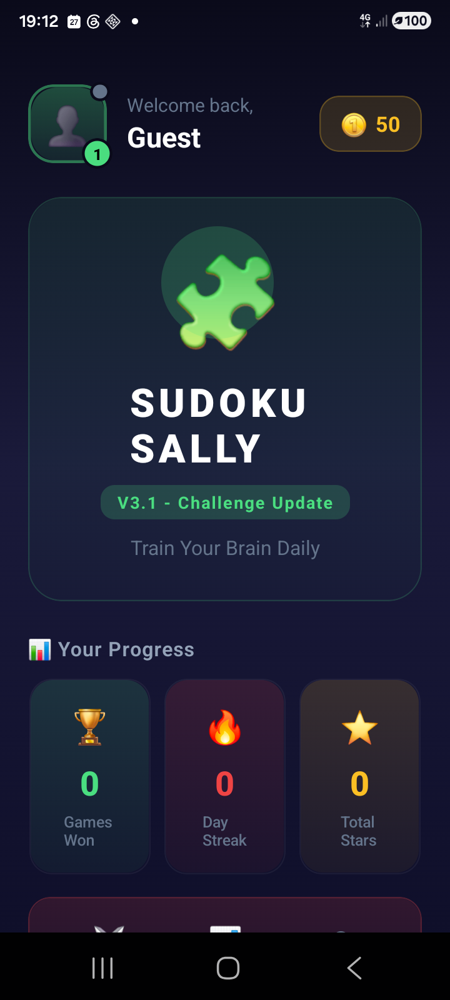 | 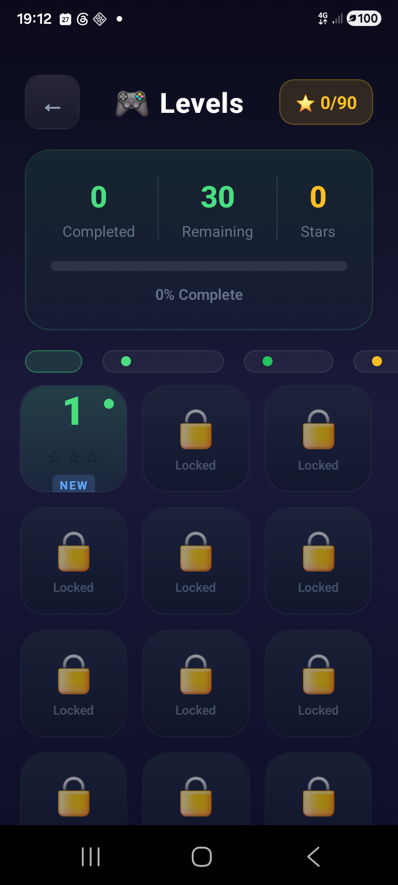 |

| Game | Daily | Challenge lobby | 1v1 Challenge |
|:---:|:---:|:---:|:---:|
| 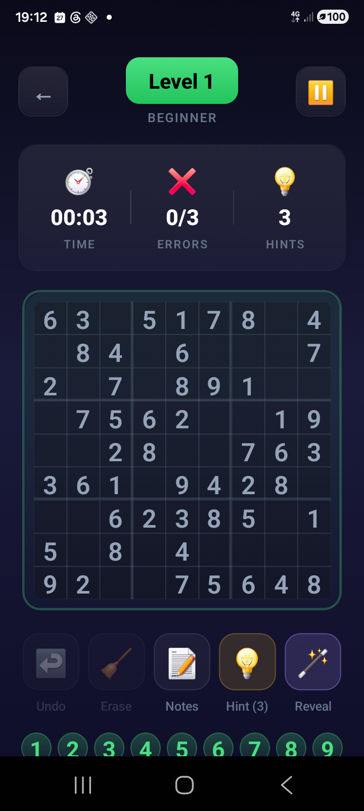 | 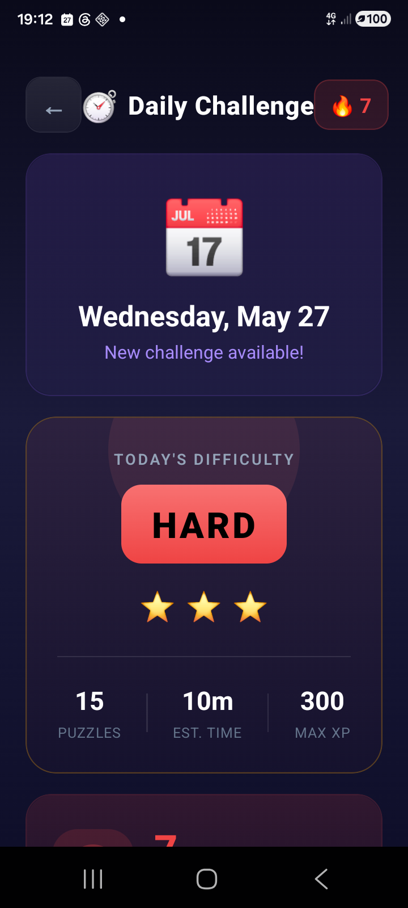 | 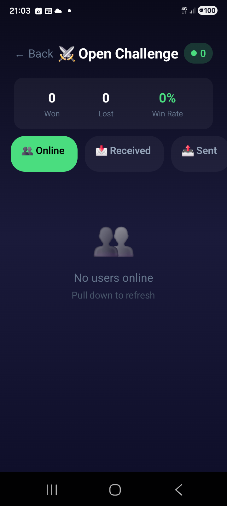 | 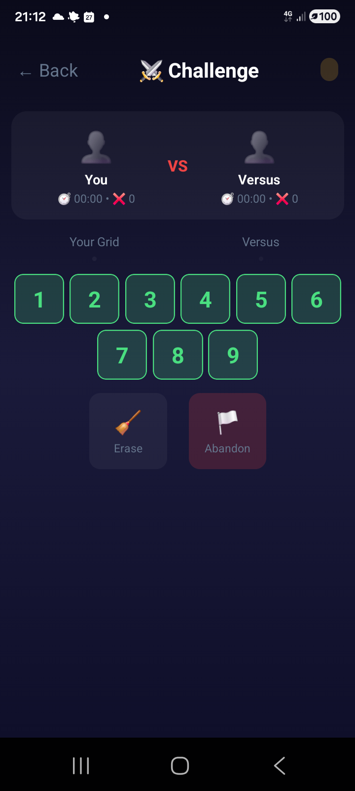 |

| Login | Register | Profile | Stats |
|:---:|:---:|:---:|:---:|
| 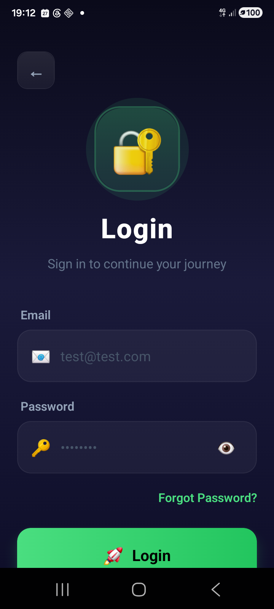 | 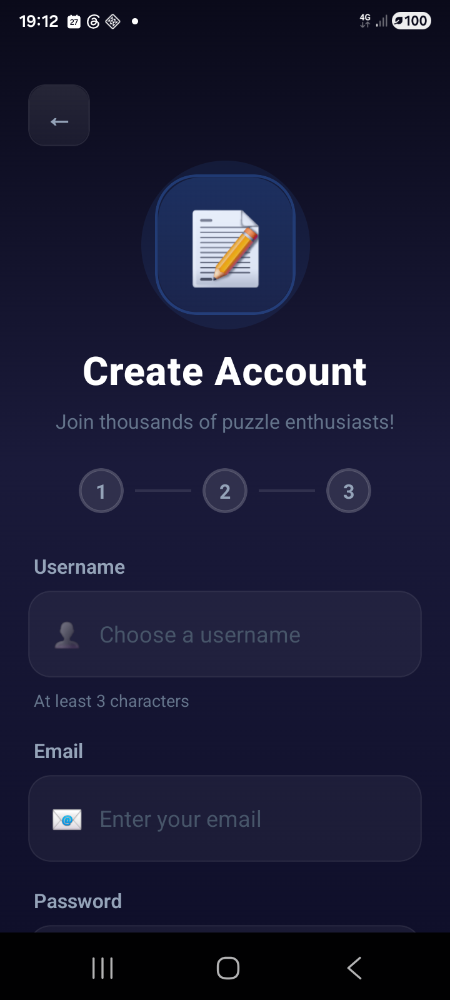 | 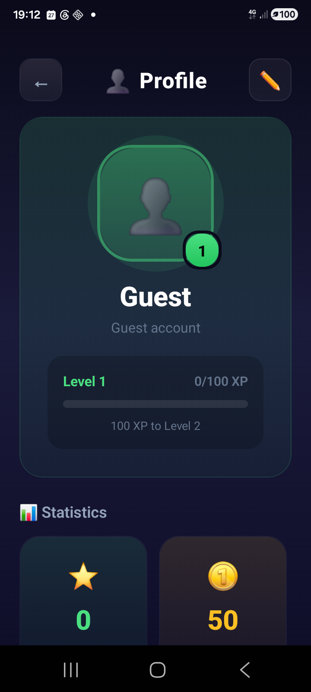 | 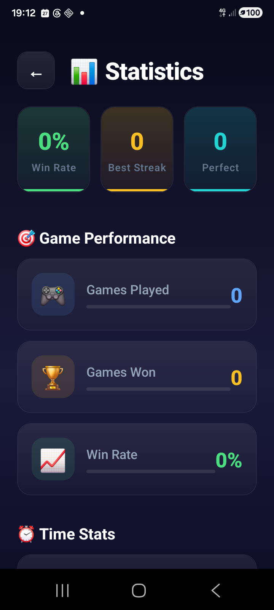 |

| Leaderboard | Achievements | Shop | Settings |
|:---:|:---:|:---:|:---:|
| 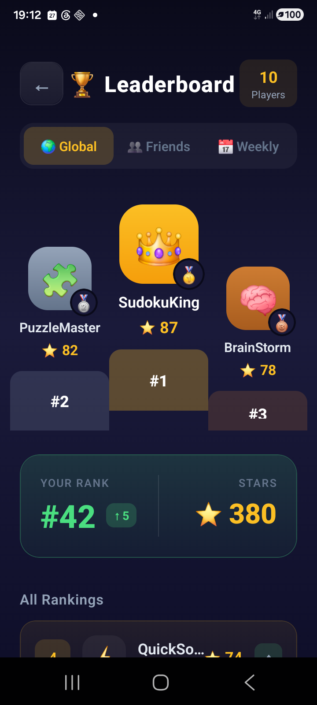 | 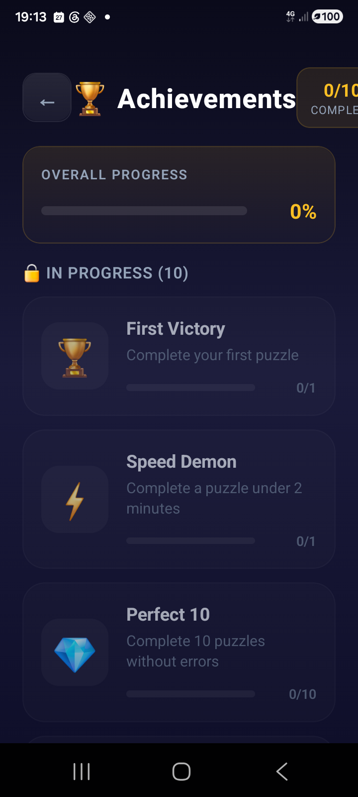 | 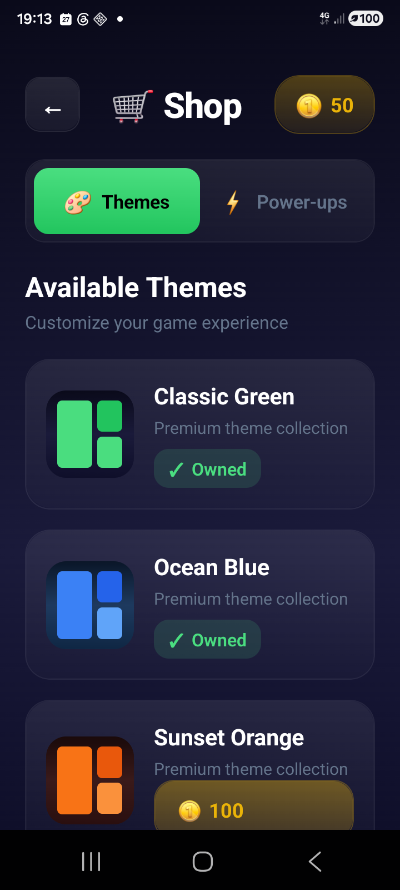 | 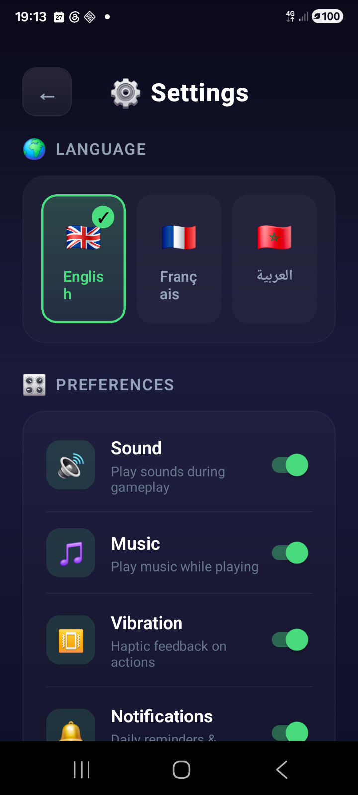 |

| Multiplayer | How to play | Tutorial | Logout dialog |
|:---:|:---:|:---:|:---:|
| 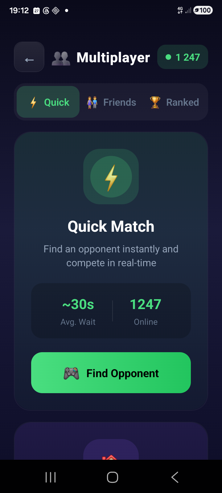 | 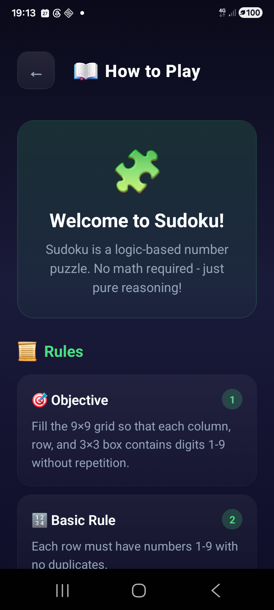 | 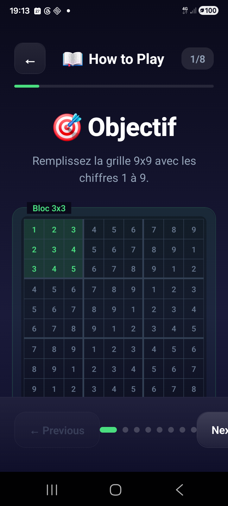 | 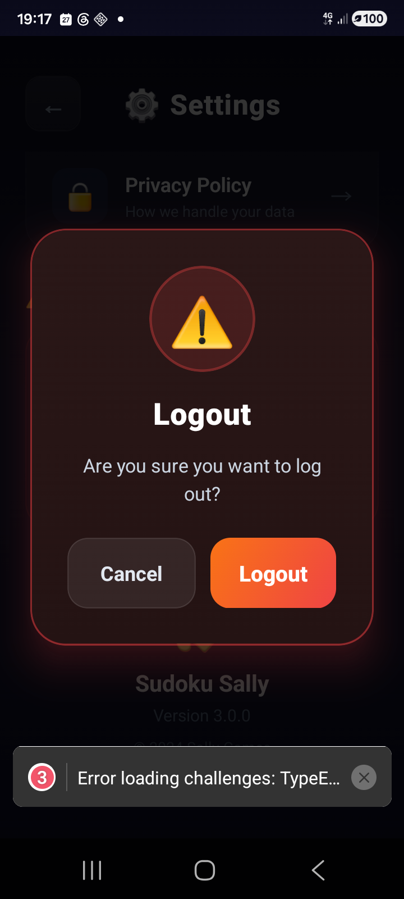 |

All 21 screens live in [`docs/screenshots/`](./docs/screenshots).

---

## 🗺️ Production architecture

```
                         Cloudflare DNS (zone: gowithsally.com)
        sudoku  (A → 88.198.205.229, 🟠 Proxied)
        api / db / cache .sudoku  (A → 88.198.205.229, ⚪ DNS-only)
                                   │
                                   ▼
                  Server 2 · gowithsally-prod · 88.198.205.229 (Hetzner)
                                   │
                          ┌────────┴─────────┐
                          │  gws-caddy        │  auto-HTTPS (Let's Encrypt)
                          │  :80 / :443       │  shared net: gowithsally_gws-net
                          └────────┬──────────┘
       sudoku.gowithsally.com  ───►│──► sudoku-landing (nginx :80) ── /api,/socket.io ─┐
       api.sudoku.gowithsally.com ►│──► sudoku-api (:3001) ◄───────────────────────────┘
       db.sudoku.gowithsally.com  ►│──► sudoku-mongo-ui (mongo-express, basic-auth)
       cache.sudoku.gowithsally.com►│─► sudoku-redis-ui (redis-commander, basic-auth)
                                    │
                       sudoku-api ──┴──► sudoku-mongo · sudoku-redis  (private net: sudoku_net)
```

Caddy already runs on the box for `gowithsally.com`; we just join its network and add site blocks. No new public ports are opened.

---

## 🚀 Run the backend locally with Docker

```bash
cd backend
docker compose up -d
```
This starts three containers (see [`backend/docker-compose.yml`](./backend/docker-compose.yml)):

| Service | Host port | URL |
|---------|-----------|-----|
| `sudoku_sally_api` (Express + Socket.IO) | **3101** → 3001 | http://localhost:3101 · health: `/health` |
| `sudoku_sally_mongo` (MongoDB 7) | **27117** → 27017 | `mongodb://localhost:27117` |
| `sudoku_sally_admin` (mongo-express) | **8181** → 8081 | http://localhost:8181 (admin / admin123) |

```bash
# quick checks
curl http://localhost:3101/health
curl -X POST http://localhost:3101/api/auth/guest      # → { success, token, user }

docker compose logs -f api      # tail logs
docker compose down             # stop (add -v to wipe the mongo volume)
```

By default the **mobile app talks to the production API** (`https://api.sudoku.gowithsally.com`) so it works on any network, including 4G. To develop the app against this local backend instead, flip `USE_LOCAL_BACKEND = true` at the top of `mobile/utils/api.ts`, `mobile/utils/socket.ts`, `mobile/app/challenges.tsx` and `mobile/app/challenge-game.tsx`.

---

## 📲 Run the mobile app

```bash
cd mobile
npm install
npx expo start --dev-client     # Metro for an installed dev build
# or build & install a dev client on a connected device:
npx expo run:android
```
If the phone is on mobile data (not the same Wi-Fi as the PC), tunnel Metro over USB:
```bash
adb reverse tcp:8081 tcp:8081
adb shell am start -a android.intent.action.VIEW \
  -d "com.sudokusally.v3://expo-development-client/?url=http%3A%2F%2Flocalhost%3A8081"
```

---

## 🐙 Push to GitHub

```bash
git add -A
git commit -m "feat: my change"
git push origin main
```
Pushing to `main` automatically triggers CI (see below). Cut a release of the APK with a version tag:
```bash
git tag v3.1.3
git push origin v3.1.3        # → builds the APK and attaches it to Release v3.1.3
```

---

## 🤖 How the CI/CD works (GitHub Actions)

Two workflows in [`.github/workflows/`](./.github/workflows):

### 1. `build-apk.yml` — builds the Android APK
- **Triggers:** push to `main` touching `mobile/**`, any `v*` tag, or manual dispatch.
- **Steps:** checkout → setup Node/Java → `npm ci` (in `mobile/`) → restore the registered debug keystore from the `ANDROID_DEBUG_KEYSTORE_B64` secret → `expo prebuild` → `gradlew assembleDebug` → upload `sudoku-sally.apk` as an artifact → **on a `v*` tag, attach it to a GitHub Release**.
- The keystore matters: its SHA-1 is registered in the Google OAuth Android client, so **Google sign-in keeps working in the distributed APK**.

### 2. `deploy.yml` — deploys the backend/landing stack to the VPS
- **Triggers:** push to `main` touching `backend/**`, `landing/**`, `deploy/**`.
- **Steps:** `appleboy/ssh-action` SSHes into **server 2** as `deploy`, then runs [`deploy/deploy.sh`](./deploy/deploy.sh): `git pull` → write `deploy/.env.prod` from secrets → `docker compose -f deploy/docker-compose.prod.yml up -d --build` → download the latest APK into the landing container so the download page self-hosts it.

### Required GitHub secrets
| Secret | Used by | Value / purpose |
|--------|---------|------|
| `ANDROID_DEBUG_KEYSTORE_B64` | build-apk | base64 of `mobile/android/app/debug.keystore` (its SHA-1 is registered with Google OAuth) |
| `SERVER_HOST` | deploy | `88.198.205.229` |
| `SERVER_USER` | deploy | `deploy` |
| `SERVER_SSH_KEY` | deploy | private key authorized on server 2 (`~/.ssh/gowithsally`) |
| `JWT_SECRET` | deploy | backend JWT signing secret |
| `REDIS_PASSWORD` | deploy | Redis password (sudoku-redis + redis-commander) |
| `UI_USER` / `UI_PASS` | deploy | basic-auth creds for the Mongo/Redis admin UIs |

```bash
# set a secret from the CLI
printf '88.198.205.229' | gh secret set SERVER_HOST --repo salistar/sudo-sally
gh secret set SERVER_SSH_KEY --repo salistar/sudo-sally < ~/.ssh/gowithsally
```

---

## 📦 Deploy the mobile APK via CI + watch it

```bash
# 1. tag a version → triggers build-apk.yml (build + Release)
git tag v3.1.3 && git push origin v3.1.3

# 2. find the run and WATCH it to completion
rid=$(gh run list --repo salistar/sudo-sally --workflow build-apk.yml \
        --branch v3.1.3 --limit 1 --json databaseId --jq '.[0].databaseId')
gh run watch "$rid" --repo salistar/sudo-sally --exit-status

# 3. confirm the APK is attached to the Release
gh release view v3.1.3 --repo salistar/sudo-sally --json assets \
  --jq '.assets[] | {name, size}'
```
The download page (`/download.html`) links to `releases/latest`, and `deploy.sh` also self-hosts the latest APK at `https://sudoku.gowithsally.com/downloads/sudoku-sally.apk`. To refresh the self-hosted copy after a new release:
```bash
ssh -i ~/.ssh/gowithsally deploy@88.198.205.229 '
  tmp=$(mktemp)
  curl -fsSL https://github.com/salistar/sudo-sally/releases/latest/download/sudoku-sally.apk -o "$tmp"
  docker cp "$tmp" sudoku-landing:/usr/share/nginx/html/downloads/sudoku-sally.apk
  docker exec sudoku-landing chmod 644 /usr/share/nginx/html/downloads/sudoku-sally.apk
  rm -f "$tmp"'
```

---

## ☁️ Deploy the containers on the VPS (full walkthrough)

### 0. Connect
```bash
ssh -i ~/.ssh/gowithsally deploy@88.198.205.229      # root login is disabled
```

### 1. Get the code + secrets on the server
```bash
mkdir -p ~/apps && cd ~/apps
git clone https://github.com/salistar/sudo-sally.git
cd sudo-sally/deploy
cat > .env.prod <<EOF
JWT_SECRET=$(openssl rand -hex 32)
REDIS_PASSWORD=$(openssl rand -hex 24)
UI_USER=sally
UI_PASS=$(openssl rand -hex 12)
EOF
chmod 600 .env.prod
```

### 2. Build & launch the containers
```bash
docker compose --env-file .env.prod -f docker-compose.prod.yml up -d --build
docker compose --env-file .env.prod -f docker-compose.prod.yml ps
```
This builds and starts: `sudoku-landing`, `sudoku-api`, `sudoku-mongo`, `sudoku-redis`, `sudoku-mongo-ui`, `sudoku-redis-ui`.
The public-facing ones join the **external `gowithsally_gws-net`** network so Caddy can reach them by name; data stores stay on the private `sudoku_net`. **No host ports are published** — Caddy fronts everything on 443.

> The whole thing is also automated by [`deploy/deploy.sh`](./deploy/deploy.sh) (used by CI). Run it manually with: `JWT_SECRET=… REDIS_PASSWORD=… UI_USER=… UI_PASS=… bash deploy/deploy.sh`.

### 3. Create the sub-domains (Cloudflare DNS → server IP)
DNS for `gowithsally.com` is on Cloudflare. Add A records pointing each host to the VPS IP. Via the dashboard (DNS → Add record) **or** the API:
```bash
TOKEN=<cloudflare-zone-dns-edit-token>
ZONE=$(curl -s "https://api.cloudflare.com/client/v4/zones?name=gowithsally.com" \
  -H "Authorization: Bearer $TOKEN" | python3 -c 'import sys,json;print(json.load(sys.stdin)["result"][0]["id"])')

# apex app domain → Proxied (orange) is fine (covered by Cloudflare's *.gowithsally.com cert)
curl -s -X POST "https://api.cloudflare.com/client/v4/zones/$ZONE/dns_records" \
  -H "Authorization: Bearer $TOKEN" -H "Content-Type: application/json" \
  --data '{"type":"A","name":"sudoku","content":"88.198.205.229","proxied":true}'

# 2-level hosts (api/db/cache.sudoku) → DNS-only (grey): Cloudflare's universal cert
# does NOT cover *.sudoku.gowithsally.com, so let Caddy issue per-host certs instead.
for h in api.sudoku db.sudoku cache.sudoku; do
  curl -s -X POST "https://api.cloudflare.com/client/v4/zones/$ZONE/dns_records" \
    -H "Authorization: Bearer $TOKEN" -H "Content-Type: application/json" \
    --data "{\"type\":\"A\",\"name\":\"$h\",\"content\":\"88.198.205.229\",\"proxied\":false}"
done
```

### 4. Wire the sub-domains to the containers (Caddy reverse proxy)
Append the blocks from [`deploy/Caddyfile.snippet`](./deploy/Caddyfile.snippet) to the box's Caddyfile (`~/apps/go-with-sally-backoffice/Caddyfile`):
```caddy
sudoku.gowithsally.com      { encode gzip zstd; reverse_proxy sudoku-landing:80 }
api.sudoku.gowithsally.com  { encode gzip zstd; reverse_proxy sudoku-api:3001 { header_up X-Forwarded-Proto https } }
db.sudoku.gowithsally.com   { encode gzip zstd; reverse_proxy sudoku-mongo-ui:8081 }
cache.sudoku.gowithsally.com{ encode gzip zstd; basic_auth { sally <bcrypt-hash> }; reverse_proxy sudoku-redis-ui:8081 }
```
Then validate & apply (a **restart** reliably re-issues certs for new hosts; a plain reload may not):
```bash
docker exec gws-caddy caddy validate --config /etc/caddy/Caddyfile --adapter caddyfile
docker restart gws-caddy
# generate a bcrypt hash for basic_auth:
docker exec sudoku-api node -e "console.log(require('bcryptjs').hashSync('<UI_PASS>',12))"
```
Caddy automatically obtains Let's Encrypt certificates over HTTP-01 once the DNS records resolve to the server.

### 5. Verify the live services
```bash
curl -sI https://sudoku.gowithsally.com/                       # 200 (CDN: server: cloudflare)
curl -s  https://api.sudoku.gowithsally.com/health             # {"status":"ok"} → 200
curl -X POST https://api.sudoku.gowithsally.com/api/auth/guest  # { success, token }
# db/cache UIs prompt for basic auth (UI_USER / UI_PASS)
```

### Day-to-day ops
```bash
docker compose --env-file deploy/.env.prod -f deploy/docker-compose.prod.yml ps
docker compose --env-file deploy/.env.prod -f deploy/docker-compose.prod.yml logs -f api
docker compose --env-file deploy/.env.prod -f deploy/docker-compose.prod.yml restart api
```

---

## 🔐 Google sign-in — switch from Test mode to Production

Google sign-in works in the dev/release APK because the signing keystore's SHA-1 is registered in the **Android OAuth client**. While the OAuth consent screen is in **Testing**, only the emails listed under *Test users* can sign in. To open it to everyone:

1. **Google Cloud Console** → your project → **APIs & Services → OAuth consent screen**.
2. Under **Publishing status: Testing**, click **PUBLISH APP** → confirm. Status becomes **In production**.
3. If the app only requests the basic `email` / `profile` / `openid` scopes (this app does), Google **does not require verification** — publishing is instant and any Google account can sign in.
4. (Only if you later add *sensitive/restricted* scopes will Google ask you to submit for **verification**: provide an app logo, a privacy-policy URL — you have https://sudoku.gowithsally.com/privacy.html — the authorized domain `gowithsally.com`, and a demo video.)

Checklist for Google sign-in to work end-to-end:
- **Android OAuth client**: package `com.sudokusally.v3` + the keystore SHA-1 (debug: `5E:8F:16:06:2E:A3:CD:2C:4A:0D:54:78:76:BA:A6:F3:8C:AB:F6:25`). For a Play Store build, also add Google Play's **App Signing SHA-1**.
- **Web OAuth client** ID is passed as `webClientId` in `mobile/utils/googleAuth.ts` (used to mint the ID token).
- Both clients live in the **same** Google Cloud project.

---

## ✅ What's verified working

- Landing, API (`/health`, guest auth), Mongo & Redis admin UIs — all live over HTTPS.
- **Real 1v1 challenge match** end-to-end on the prod backend (challenge → accept → play → finish → winner by time/errors → stats).
- APK builds in CI, signed so **Google sign-in works**, attached to Releases and self-hosted on the site.

---

© 2026 Sudoku Sally
